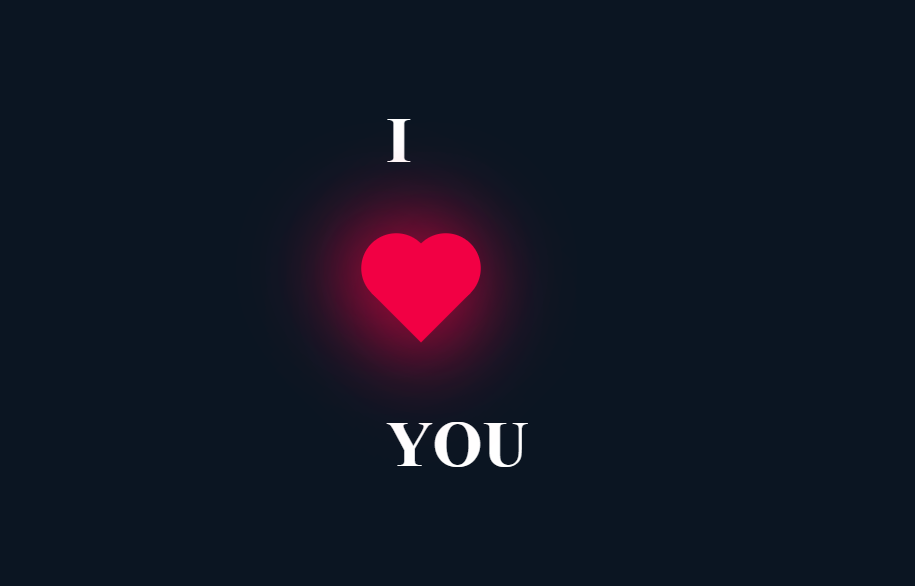

# HTML
 
 i used **html** for basic things in this project...

 only for **2 div**

 # CSS

 **CSS** has an influential role in this project 
 decoration, colors, background-colors, and other things made by **CSS**